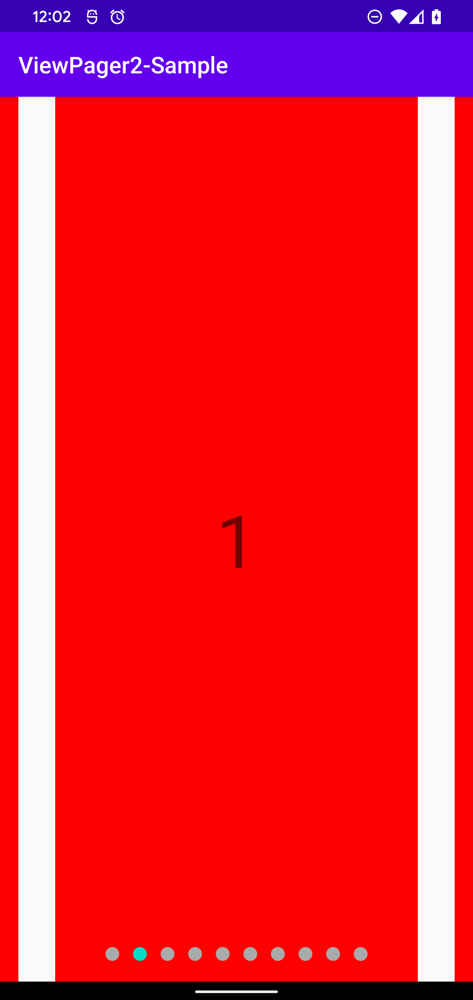

# ViewPager2 Sample

A ViewPager2 usage sample with TabLayout.

<table>
    <tr>
        <th>branch: master</th>
        <th>branch: add_page_margin</th>
    </tr>
    <tr>
        <td></td>
        <td></td>
    </tr>
</table>
